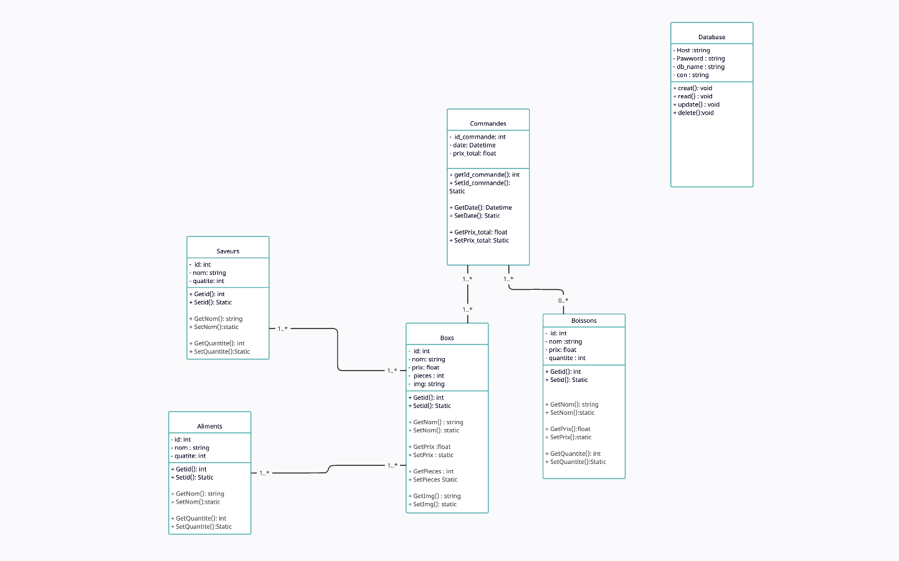

# Zushi

This project was generated with [Angular CLI](https://github.com/angular/angular-cli) version 16.2.2.

## Development server

Run `ng serve` for a dev server. Navigate to `http://localhost:4200/`. The application will automatically reload if you change any of the source files.

## Code scaffolding

Run `ng generate component component-name` to generate a new component. You can also use `ng generate directive|pipe|service|class|guard|interface|enum|module`.

## Build

Run `ng build` to build the project. The build artifacts will be stored in the `dist/` directory.

## Running unit tests

Run `ng test` to execute the unit tests via [Karma](https://karma-runner.github.io).

## Running end-to-end tests

Run `ng e2e` to execute the end-to-end tests via a platform of your choice. To use this command, you need to first add a package that implements end-to-end testing capabilities.

## Further help

To get more help on the Angular CLI use `ng help` or go check out the [Angular CLI Overview and Command Reference](https://angular.io/cli) page.

# Zushi

Zushi est un projet  d'application web de gestion des commandes pour un restaurant de sushi, l'objecitf est de créer un projet pluridisciplinaire mélangeant des compétence en développement front, développement back et UX/UI Design. Les missiosn étaient de réaliser une RESTAPI dans le langage de notre choix, nous avons choisi Symfony en mode API. Nous vons également réaliser une maquette et intégrer la partie front à l'aide d'Angular liant grâce à ses services le front et le back.

# Lien vers l'api

[RestAPI](https://github.com/GuedesAlexandre/ZushiRestAPI)

# Lien vers la maquette

[Maquette](https://www.figma.com/file/G9vExLtz6G4M3Kf6DDA4z6/SAE-4.01?type=design&node-id=14%3A2&mode=design&t=KuMFDFSaS42PqGTe-1)

# Diagramme de classe

